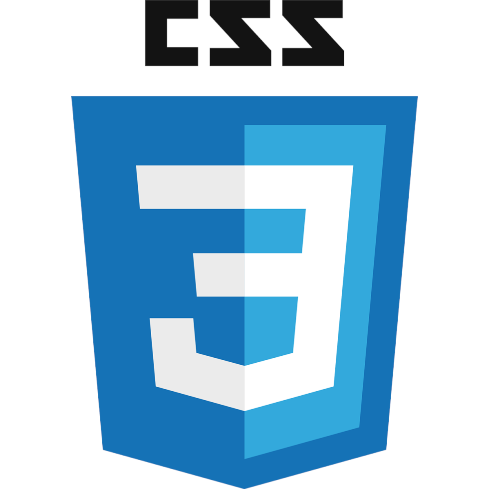

Hello👋, my name is Michael and I'm a front-end developer with a focus on mobile app development. I'm currently offering Computer Science at University of Ghana, where I'm building my technical skills and staying up-to-date with the latest technologies.

In addition to my programming skills in HTML, CSS, JavaScript, and React.js, I'm also proficient in Microsoft Office and spreadsheet tools, as well as graphic designing. I believe my diverse skillset allows me to approach development projects from multiple angles and create solutions that are both functional and visually appealing.

I'm passionate about creating user-friendly interfaces and solving real-world problems through technology. As a fullstack developer, I'm always looking for new challenges and opportunities to learn and grow. If you're interested in working together or have any questions, please feel free to reach out to me!🔥😎

### What I Know

<table>
  <tbody>
    <tr>
      <td></td>
      <td></td>
      <td></td>
      <td></td>
      <td></td>
      <td></td>
      <td></td>
    </tr>
  </tbody>
</table>

### What I'm currently learning

<table>
  <tbody>
    <tr>
      <td></td>
      <td></td>
      <td></td>
    </tr>
  </tbody>
</table>

### Full Stack Projects

<!-- 

 -->

### What I would like to learn
<table>
  <tbody>
    <tr>
      <td></td>
      <td></td>
      <td></td>
      <td></td>
    </tr>
  </tbody>
</table>

